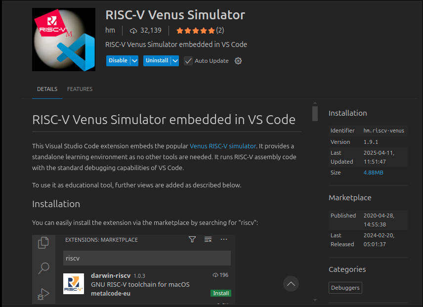
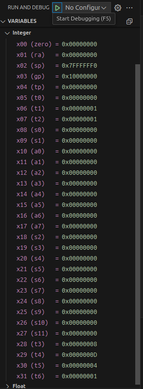

# RISC-V Labs Template

This repository serves as a template for organizing RISC-V lab exercises that mix C and assembly code. Each lab is contained within its own directory, and all compiled artifacts (object files, executables, etc.) are centralized in the `build/` folder. Additionally, the repository includes automation scripts to quickly set up new labs and a top-level Makefile for building and running individual labs.

## Project Structure
```
RISCV-LABS/
├── labs/                   
│   ├── lab01/              # Example lab directory
│   │   ├── lab01.s         # Assembly source file
│   │   ├── main.c          # C source file 
│   ├── lab02/              # Additional labs follow the same pattern
│   └── ...
├── build/                  # Central output directory for build artifacts
│   └── lab01/              
│       ├── lab01.o
│       ├── main.o
│       └── exe             
├── scripts/                # Automation scripts
│   └── create_lab.sh       # Script to bootstrap a new lab directory 
├── README.md               # This file – project overview and
└── makefile                 
```

## Features

- **Modular Lab Organization**: Each lab lives in its own directory under `labs/` with its own source files.
- **Centralized Build Artifacts**: All compiled outputs are directed to the `build/` folder.
- **Automation**: Use the `scripts/create_lab.sh` script to quickly generate a new lab directory complete.
- **Top-Level Makefile**: Easily build, run, or clean a specific lab by passing a parameter (e.g., `make lab=lab01`).

## First Steps

First, we need install some packages in Linux terminal:

    sudo apt update 

    sudo apt install gcc-riscv64-linux-gnu -y 

    sudo apt install qemu-kvm qemu-system-misc u-boot-qemu qemu-user 

## Install RISC-V Venus Simulator for Debug

To help you debug the simulation, you need to install the extension called RISC-V Venus Simulation.



This extension allows you to see the registers and debug your assembly code.




### Creating a New Lab

From the project root, run:

```bash
./scripts/create_lab.sh <lab_number>
```

This command will generate a new folder `labs/lab<lab_number>/` with the following starter files:
- `main.c`
- `lab<lab_number>.s`
- `Makefile`


### Building and Running a Lab

You can build and run any lab using the top-level Makefile. For example, to build and run lab01:

```bash
make LAB=lab01       # Builds lab01
make LAB=lab01 run   # Runs lab01 using QEMU
```

The Makefile is configured to output its compiled artifacts to the corresponding subdirectory in `build/`. To remove build artifacts for a specific lab, run:

```bash
make LAB=lab01 clean
```

This command deletes the `build/lab01/` directory.

### RISC-V links for studies

- **WikiChip** https://en.wikichip.org/wiki/risc-v/registers

- **RISC-V Assembler Cheat Sheet** https://projectf.io/posts/riscv-cheat-sheet/

- **RISC-V Web Simulator** https://riscv.vercel.app